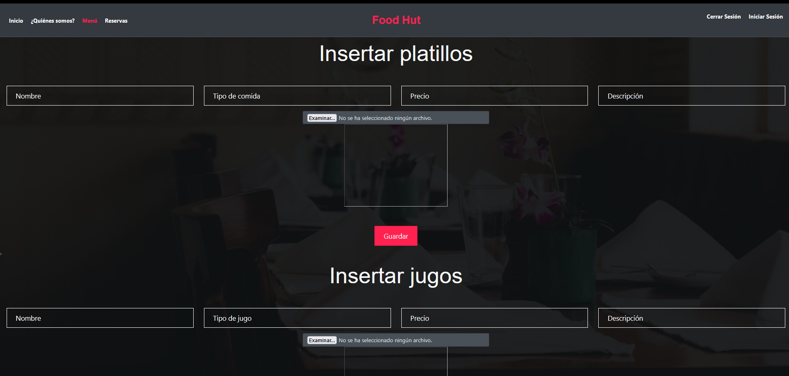
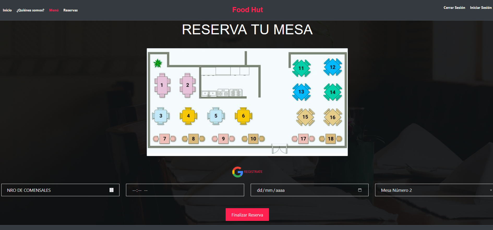

<p align="center">
  <a href="https://www.php.net/" target="_blank">
    
  </a>
</p>

<h2 align="center">Sistema Restaurante – Gestión Web</h2>

Aplicación web para administrar de manera integral las operaciones internas de un restaurante: usuarios, pedidos, menús, inventario y reportes. Ideal para locales pequeños o medianos que buscan automatizar su gestión diaria.


## Requisitos del sistema

- PHP ≥ 7.4  
- Composer  
- MySQL / MariaDB  
- XAMPP / Laragon / Servidor local  
- Extensiones PHP necesarias: `pdo`, `mbstring`, `openssl`, `json`, `fileinfo`, `ctype`

---

## Instalación del proyecto

```bash
# Clonar el repositorio
git clone https://gitingest.com/velardep/Sistema_Restaurante.git
cd Sistema_Restaurante

# Instalar dependencias PHP (si se usan)
composer install
````

1. Coloca el proyecto dentro del directorio `htdocs` (si usas XAMPP).
2. Crea una base de datos llamada `foothut2`.
3. Importa el archivo `foothut2.sql` desde phpMyAdmin o CLI.
4. Asegúrate de tener Apache y MySQL activos.
5. Abre tu navegador en:

   ```bash
   http://localhost/Sistema_Restaurante
   ```

---

## ¿Cómo funciona?

* El sistema tiene autenticación de usuarios (login básico).
* Organización por módulos:

  * `model/` → lógica y conexión con la base de datos
  * `view/` → vistas HTML/PHP con la lógica visual
  * `config/` → configuración general (BD, rutas, etc.)
  * `file/`, `img/`, `public_html/` → recursos y assets
* Puede funcionar sin framework, pero sigue una estructura MVC ligera.

---

## Tecnologías usadas

* PHP puro (con opción de integrar Laravel)
* MySQL
* JavaScript
* HTML/CSS
* Bootstrap (posiblemente)
* Gulp (automatización frontend)
* Composer (dependencias PHP)

---
## Restaurar la base de datos

1. Accede a `http://localhost/phpmyadmin`
2. Crea una base de datos llamada `foothut2`
3. Importa el archivo `foothut2.sql` incluido en el repositorio

> ⚠️ **IMPORTANTE**:  
> La primera vez que ingreses al sistema, se mostrará la vista de usuarios (cliente).  
> Para acceder a la **vista de administrador**, sigue estos pasos:
>
> 1. Regístrate con cualquier correo desde la vista de usuarios.
> 2. Abre `phpMyAdmin`, selecciona la base `foothut2`, y entra a la tabla `cliente`.
> 3. Ubica el correo registrado y cambia el valor del campo `rol` de `0` a `1`.
>
> - `rol = 0` → Usuario cliente  
> - `rol = 1` → Usuario administrador  
>
> Al iniciar sesión nuevamente con ese correo, serás redirigido a la vista de administrador.
---


## Ejecución local

Abre tu navegador y ve a:

```
http://localhost/Sistema_Restaurante
```

## Capturas de pantalla

A continuación, algunas vistas del sistema en funcionamiento:

<p align="center">
  <br>
    <em>Menu</em>
</p>

<p align="center">
  <br>
  <em>Gestion de Menu</em>
</p>

<p align="center">
  <br>
  <em>Registro de Reserva</em>
</p>

---

## Destinado a

* Emprendedores gastronómicos
* Restaurantes pequeños o medianos
* Estudiantes de programación
* Proyectos académicos de software

---

---

## Notas

* El proyecto puede ampliarse fácilmente con funciones como delivery, pagos en línea, facturación, etc.
* Si tienes errores con rutas o archivos, revisa el `.htaccess` o la configuración del entorno.
* Se recomienda trabajar con un servidor local que soporte URLs amigables (mod\_rewrite habilitado).
* Aclarar que este proyecto necesita mejoras para su implementacion comercial.
---


